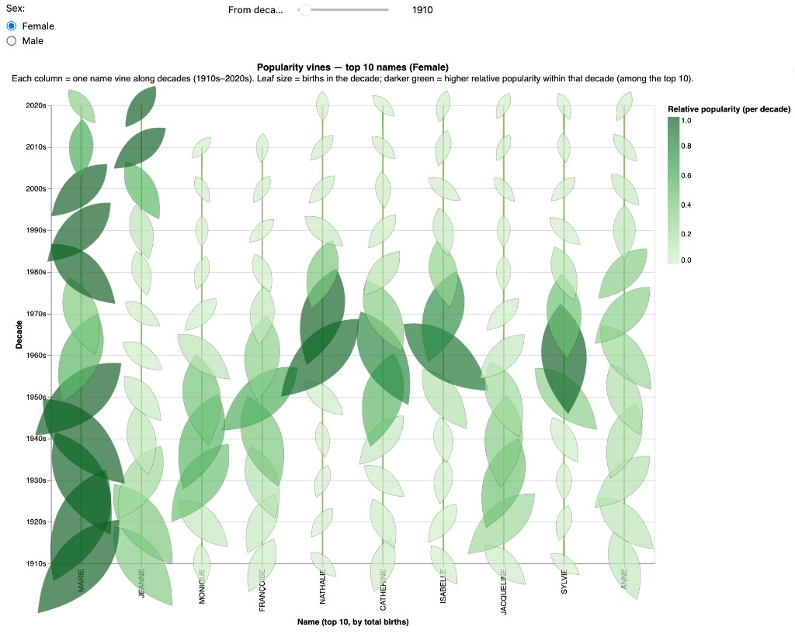
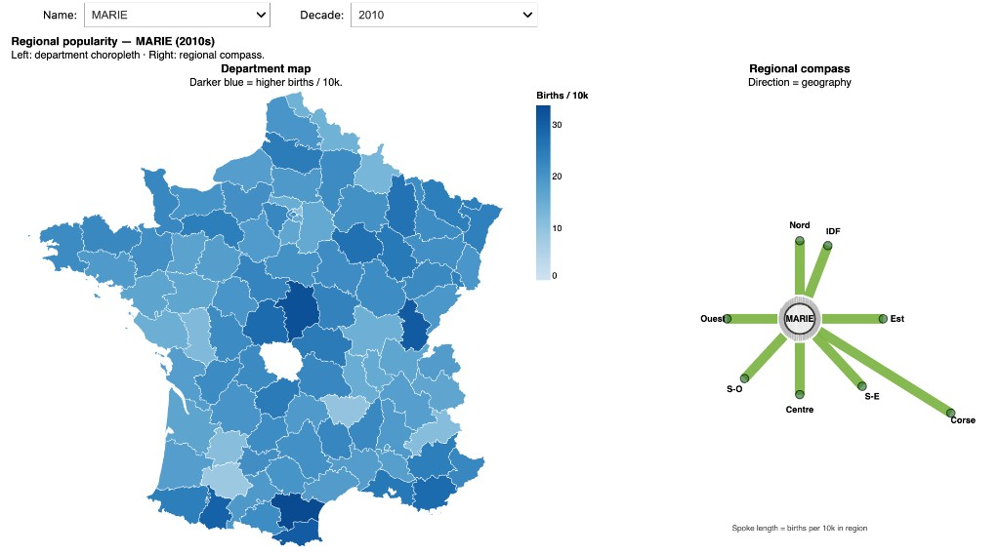
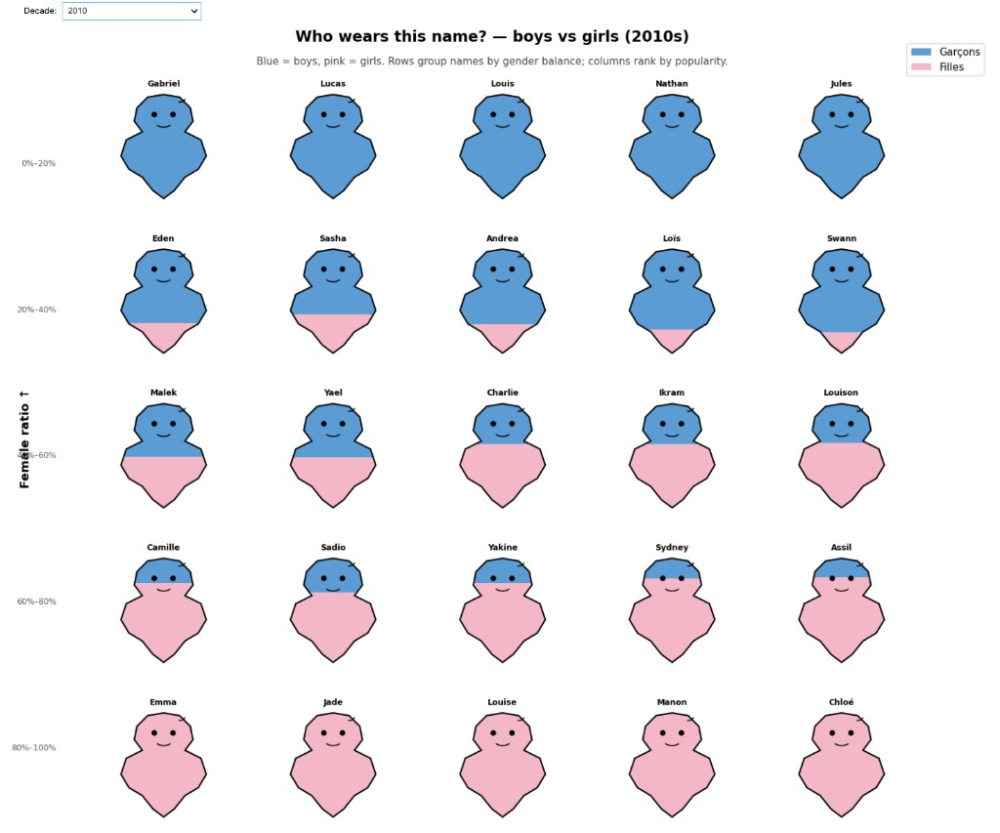
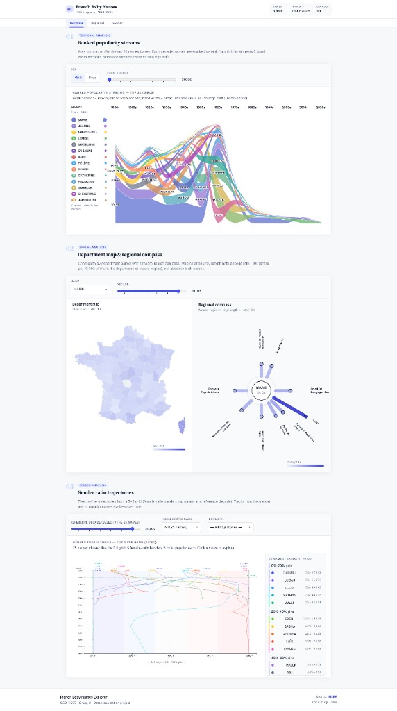

# Baby Names — Group G

Mini-project on French baby names (1900–2022) for **CSC 4IG07 — Data Visualization**.

**Final deliverable:** interactive web app in [`app/`](app/) — three linked views over **time**, **space**, and **gender**. See [`app/README.md`](app/README.md) for details.

| Section | Visualization |
| --- | --- |
| **1 — Temporal** | Ranked area bump streams — top 20 |
| **2 — Regional** | Choropleth map + regional compass |
| **3 — Gender** | Gender ratio trajectories — 25 names, 5 bands |

## Design rationale

Our **first three chart choices** — prototyped in [`notebooks/baby_names_3_implementation.ipynb`](notebooks/baby_names_3_implementation.ipynb) — had a high risk of **chartjunk** (visual elements that add complexity without adding information). After a critical review, we replaced them with three more rigorous views in the web app:

| Dimension | First iteration | Final app |
| --- | --- | --- |
| **Temporal** | 1.6 *Popularity vines* (botanical metaphor) | Ranked area bump streams |
| **Regional** | 2.1 Choropleth + 2.9 *Regional compass* | Same pairing (refined scales & layout) |
| **Gender** | 3.3 *Boys vs girls per name* (silhouette icons) | Gender ratio trajectories |

## Before & after

First iteration [`notebooks/baby_names_3_implementation.ipynb`](notebooks/baby_names_3_implementation.ipynb) → final web app [`app/`](app/).

<table>
  <tr>
    <th align="center" width="48%">Before — notebook prototypes</th>
    <th align="center" width="52%">After — web app</th>
  </tr>
  <tr>
    <td valign="top">
      <p><strong>1 — Temporal</strong> · <em>Popularity vines</em> (botanical metaphor)</p>
      
      <p><strong>2 — Regional</strong> · choropleth + <em>regional compass</em></p>
      
      <p><strong>3 — Gender</strong> · <em>Boys vs girls</em> (silhouette icons)</p>
      
    </td>
    <td valign="top">
      <p><strong>Ranked area bump streams</strong> · <strong>map + compass</strong> (refined) · <strong>gender ratio trajectories</strong></p>
      
    </td>
  </tr>
</table>

**Ranked popularity streams** encode both rank and volume in one glance; stream crossings highlight shifts in popularity (overlap can make individual names harder to follow).

**Department map & regional compass** offer departmental detail and macro-regional synthesis without duplicating data; subtle rate differences can be flattened by the color scale, and compass rays fade when values are near zero.

**Gender ratio trajectories** show names that drift between genders over decades; the 5×5 grid structures comparison, though 25 curves can crowd labels at the endpoints.

These three views cover the core dimensions of the dataset with minimal visual noise and maximum useful encoding.

## Data

The dataset comes from the French national statistics office (INSEE): **Fichier des prénoms par département**.  
It contains all first names registered in France, year by year and department by department, from 1900 to 2022.

- `data/dpt2020.csv` — main dataset (~3.8M rows, format: `sexe;preusuel;annais;dpt;nombre`)
- `data/departements.geojson` — simplified GeoJSON map of French departments
- `data/bump_data.csv`, `data/map_data.csv`, `data/gender_data.csv` — pre-aggregated exports used by the web app (notebooks can recompute from `dpt2020.csv`)

## Run the web app

Requires Node.js 18+.

```bash
cd app
npm install
npm run dev
```

Open the URL shown in the terminal (default http://localhost:5173).

## Notebooks (exploration & iteration)

Requires Python 3.11 and [uv](https://github.com/astral-sh/uv).

```bash
uv sync
uv run jupyter notebook
```

| Notebook | Description |
| --- | --- |
| `notebooks/baby_names_30_viz_group_G_.ipynb` | Week 1 — Brainstorming: 30 visualization ideas (3 questions × 10 ideas) |
| `notebooks/baby_names_9_viz_group_G_.ipynb` | Week 1 — Selection: 9 finalists (3 per question) with justifications |
| `notebooks/baby_names_9_implementation.ipynb` | Week 2 — Nine interactive prototypes (Altair + ipywidgets + matplotlib) |
| `notebooks/baby_names_3_implementation.ipynb` | First three-chart iteration (*vines*, *compass*, *silhouettes*) — superseded by the web app |

## Dependencies

- **Web app:** Vite, D3.js — see [`app/package.json`](app/package.json)
- **Notebooks:** see `pyproject.toml` — `altair`, `pandas`, `geopandas`, `matplotlib`, `ipywidgets`, `jupyter`, `vegafusion`
